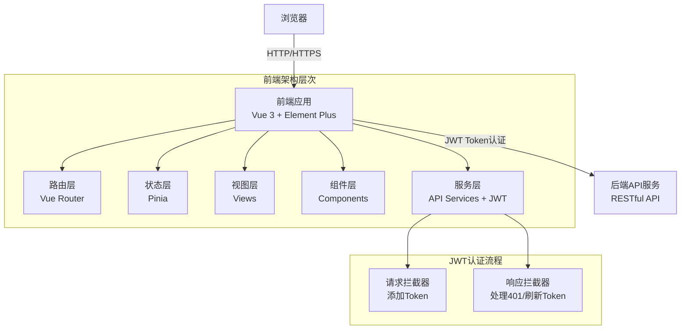
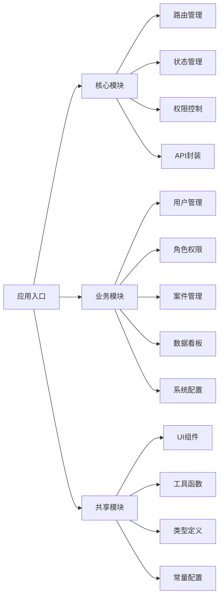
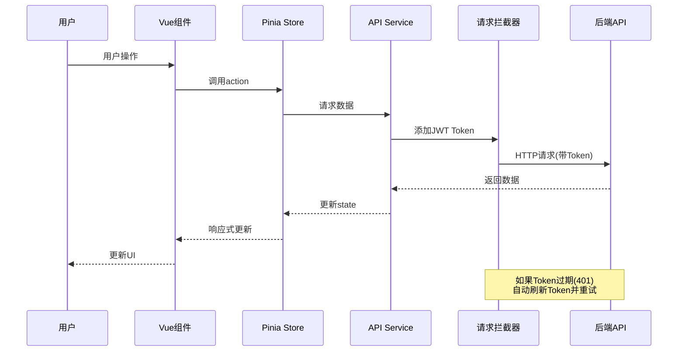

## 产品概述

信贷催收案件管理系统是一个面向催收团队的企业级Web应用前端项目,帮助催收人员高效管理案件、跟进客户、记录沟通过程,并为管理层提供数据分析和决策支持。系统支持多角色协同工作,具备完善的权限控制和审计功能。

**项目定位**: 本项目为纯前端开发项目,使用Mock数据或对接后端API接口,专注于用户界面和交互体验的实现。

## 核心功能

### 用户认证与权限管理

- **用户认证**: 基于JWT Token的登录认证机制,登录页面包含账号、密码和图片验证码输入,前端实现token存储、请求头自动注入、token自动刷新和超时自动登出
- **用户管理**:创建、编辑、删除用户账号,设置用户状态(启用/禁用),支持批量操作
- **角色管理**:定义不同角色(管理员、主管、催收员等),配置角色权限,支持角色继承
- **权限管理**:细粒度权限控制,包括菜单访问权限和按钮操作权限,支持动态权限分配,实时生效

### 首页看板

- **核心统计指标**:展示5个核心统计模块
  - 仲裁案件数统计:当前仲裁案件总数及环比变化
  - 执行案件数统计:当前执行案件总数及环比变化
  - 法院立案月度统计:本月法院立案数及月度趋势图
  - 回款月度统计:本月回款金额及月度趋势图
  - 触达记录数月度统计:本月触达记录数及月度趋势图
- **可视化图表**:使用ECharts绘制月度趋势图(折线图/柱状图),直观展示数据变化趋势
- **快捷入口**:提供待处理事项提醒,快速跳转到对应业务页面

### 案件核心功能

- **案件管理**:创建新案件、编辑案件信息、查看案件详情、案件状态流转(待分配→进行中→已结清→坏账等),支持高级搜索和筛选(按产品、逾期天数范围、借款编号等)
- **案件详情**:完整展示案件信息,包括:
  - 基本信息:客户信息、案件状态、分配人等
  - 借款合同信息:借款编号、借款金额、放款金额、借款期限、利率、还款信息等
  - 债务人信息:姓名、身份证、联系方式、户籍信息、工作信息等
  - 仲裁信息:仲裁案号、仲裁委、仲裁员、仲裁费用、仲裁状态、各种日期等
  - 执行信息:中院/基层执行案号、案件阶段、法院信息、法官联系方式等
  - 触达记录:完整的触达历史,包含触达对象、通话状态、还款意愿、PTP信息等
- **案件分配**:将案件分配给催收员,支持单个分配和批量分配,支持案件重新分配和转移,智能负载均衡
- **触达记录管理**:记录每次触达的详细信息
  - 触达方式:电话催收、微信、网查
  - 触达对象:关系、姓名、电话、地址
  - 通话状态:接通、未接听、关机、挂机、停机等12种状态
  - 还款意愿:承诺还款、已还款、违诺、无还款意愿等多种分类
  - PTP信息:承诺还款金额、承诺还款时间
  - 下次跟进策略:需跟进、无需跟进,下次跟进时间
  - 查看完整触达历史时间轴

### 仲裁与执行管理

- **仲裁信息管理**:
  - 维护仲裁案号、仲裁委名称、仲裁员、仲裁秘书等信息
  - 记录仲裁费用、仲裁标的金额
  - 跟踪仲裁流程:暂计日、受理日期、立案日期、组庭日期、开庭日期、裁决日期
  - 仲裁状态管理:撤案、待出裁、已经出裁
- **执行信息管理**:
  - 维护中院执行案号和基层执行案号
  - 记录案件当前阶段和案件状态
  - 管理法院信息:中级法院、基础法院、省份、市、县地区
  - 维护法官联系方式:中院/基院立案庭和执行庭法官及电话
  - 记录利息信息:利息罚息、迟延履行金、申请执行利率

### 工单管理

- **工单类型**:支持投诉、协商还款、信息报备、客户回访四种类型
- **工单创建**:关联案件,记录来电手机号,填写工单内容
- **工单流转**:支持工单提交、工单流转(更换处理人)、工单解决
- **工单处理**:处理人可查看工单详情,填写处理说明,流转或解决工单
- **工单查询**:支持按类型、状态、处理人、时间范围筛选查询
- **流转记录**:完整记录工单流转历史,包括操作人、处理人、操作时间、流转说明

### 对账申请管理

- **对账申请**:
  - 提交对账申请:填写流水号、凭证金额、还款日期、还款方式
  - 汇款人信息:汇款人姓名、手机号、与客户关系(直系亲属/朋友/同事/本人/机构代还)
  - 关联债务人和案件信息
- **审批流程**:
  - 两级审批:组长审批→财务审批
  - 审批状态:待组长审批、待财务审批、审批通过、审批不通过、已撤销
  - 审批操作:通过、驳回,填写审批意见
- **对账查询**:支持按状态、申请人、产品、时间范围筛选查询
- **审批历史**:完整记录审批流程和历史

### 数据与分析

- 数据统计看板:展示关键指标(案件总数、回款金额、回款率、催收成功率、人均案件数、逾期分布等),可视化图表展示案件状态分布、催收趋势、团队绩效
- 数据报表:生成各类催收报表(日报、周报、月报、催收员绩效报表、案件分析报表),支持自定义报表条件、图表类型和导出格式

### 业务增强功能

- 催收策略配置:配置催收策略规则(逾期天数、催收方式、升级条件)、自动提醒规则、案件升级规则,支持策略模板
- 短信/邮件通知:发送催收通知给客户,管理通知模板(支持变量替换),查看发送历史和送达状态
- 导入导出:批量导入案件数据(Excel/CSV格式,支持数据校验和错误提示),导出案件列表和报表数据(支持Excel/CSV/PDF格式)
- 操作日志审计:记录所有关键操作(登录、案件分配、状态变更、权限修改等),支持按用户、时间、操作类型、IP地址查询日志,支持日志导出

### 系统功能

- **用户认证**: 基于JWT Token的登录认证机制,登录页面包含账号、密码和图片验证码,前端实现token存储、请求头自动注入、token自动刷新和超时自动登出
- **响应式布局**: 适配桌面端主流分辨率(1920×1080、1366×768等),支持侧边栏折叠,确保在不同屏幕尺寸下的良好体验
- **多标签页**: 支持打开多个页面标签,方便在不同案件间切换,支持标签页关闭、刷新、全部关闭等操作

## 技术栈选择

### 核心技术

- **前端框架**: Vue 3(使用Composition API + `<script setup>` 语法)
- **开发语言**: TypeScript(严格类型检查)
- **构建工具**: Vite(快速开发构建)
- **UI组件库**: Element Plus(企业级Vue 3组件库),主题色配置为#3A8EE6
- **状态管理**: Pinia(Vue 3官方推荐)
- **路由管理**: Vue Router 4
- **HTTP客户端**: Axios(请求/响应拦截器、错误处理)
- **数据交互协议**: HTTP/HTTPS协议,RESTful API风格,JSON格式数据交互
- **图表库**: ECharts(数据可视化),使用#3A8EE6作为主题色
- **日期处理**: Day.js(轻量级)
- **表格处理**: SheetJS(xlsx,用于Excel导入导出)
- **代码规范**: ESLint + Prettier

### 技术理由

- **Vue 3 Composition API**: 提供更好的逻辑复用和类型推导,适合大型企业应用
- **TypeScript**: 提供类型安全,减少运行时错误,提升代码可维护性
- **Element Plus**: 成熟的企业级组件库,组件丰富,文档完善,适合管理后台
- **Pinia**: 轻量级状态管理,API简洁,完美支持TypeScript和Composition API
- **ECharts**: 功能强大的图表库,满足各类数据可视化需求

## 实现方案

### 整体架构策略

采用**分层架构 + 模块化设计**,将系统划分为:

1. **视图层(Views)**: 页面组件,负责UI展示和用户交互
2. **组件层(Components)**: 可复用的业务组件和基础组件
3. **服务层(Services/API)**: 封装API请求,统一数据交互接口
4. **状态层(Stores)**: 全局状态管理,用户信息、权限、配置等
5. **工具层(Utils)**: 通用工具函数、常量、类型定义

### 核心技术决策

#### 1. 权限控制方案

- **路由级权限**: 
  - 基于Vue Router的路由守卫,实现登录认证和权限验证
  - 未登录用户访问受保护页面时自动跳转登录页
  - 登录页路由使用BlankLayout布局,其他页面使用DefaultLayout布局
  - 根据用户角色动态加载路由
- **按钮级权限**: 自定义指令`v-permission`,根据权限码控制按钮显示/隐藏
- **菜单动态生成**: 根据后端返回的权限数据,前端动态生成菜单树
- **实现理由**: 灵活的权限控制,支持细粒度控制,易于维护和扩展

#### 2. 状态管理方案

- **用户状态(UserStore)**: 存储用户信息、token、权限列表
- **应用状态(AppStore)**: 存储侧边栏状态、标签页列表、全局配置
- **业务状态**: 按模块划分(CaseStore、DashboardStore等),按需加载
- **持久化**: 使用`pinia-plugin-persistedstate`插件,将关键状态持久化到localStorage
- **实现理由**: 模块化管理,避免单一store过于庞大,提升可维护性

#### 3. API请求封装

- **HTTP协议**: 使用HTTP/HTTPS协议与后端通信,开发环境使用HTTP,生产环境使用HTTPS
- **RESTful风格**: 遵循RESTful API设计规范(GET查询、POST创建、PUT更新、DELETE删除)
- **数据格式**: 
- 请求数据:使用JSON格式,Content-Type设置为`application/json`
- 响应数据:后端返回JSON格式数据,统一响应结构`{code, message, data, timestamp}`
- **Axios实例化**: 创建带有baseURL和超时配置的axios实例,支持环境变量配置不同的API地址
- **请求拦截器**: 
- 自动从localStorage读取JWT Token并添加到请求头Authorization字段(`Bearer ${token}`)
- 设置Content-Type为`application/json`
- 添加请求ID、timestamp等辅助信息
- **响应拦截器**: 
- 统一解析JSON响应数据
- 统一错误处理(401自动跳转登录、403提示无权限、500服务器错误提示)
- 实现JWT Token自动刷新逻辑(当token即将过期时自动调用刷新接口)
- **API模块化**: 按业务模块划分API文件(userApi.ts、caseApi.ts等),每个模块独立管理相关接口
- **类型安全**: 为所有API定义请求参数和响应数据的TypeScript接口,确保类型安全
- **实现理由**: 统一的HTTP协议和JSON数据格式,标准化的RESTful API调用,减少重复代码,提升开发效率和代码质量,JWT Token机制确保安全认证

#### 4. 性能优化方案

- **路由懒加载**: 使用`import()`动态导入,按需加载页面组件
- **组件懒加载**: 大组件(如图表、编辑器)使用异步组件
- **虚拟滚动**: 案件列表使用虚拟滚动技术(如`vue-virtual-scroller`),处理大数据量
- **分页加载**: 列表数据采用分页加载,避免一次性加载过多数据
- **防抖节流**: 搜索框输入、窗口resize等事件使用防抖或节流
- **图片懒加载**: 使用`v-lazy`指令,延迟加载图片资源
- **实现理由**: 提升首屏加载速度和运行时性能,改善用户体验

#### 5. 数据可视化方案

- **ECharts集成**: 封装通用的图表组件(LineChart、BarChart、PieChart等)
- **响应式图表**: 监听窗口resize事件,自动调整图表大小
- **数据更新**: 使用`watch`监听数据变化,自动更新图表
- **主题定制**: 定义统一的图表主题色,保持视觉一致性
- **实现理由**: ECharts功能强大,社区活跃,文档完善,满足复杂图表需求

## 实现细节

### 性能考量

- **首屏加载**: 预计首屏加载时间控制在2秒内(gzip压缩、代码分割、CDN加速)
- **列表渲染**: 案件列表支持10000+数据的流畅滚动(虚拟滚动,时间复杂度O(视口数量))
- **搜索筛选**: 前端搜索使用防抖(300ms),后端搜索使用索引,响应时间<500ms
- **图表渲染**: ECharts渲染10000+数据点时,使用数据抽样或聚合,保持流畅交互
- **内存管理**: 及时清理定时器、事件监听器,避免内存泄漏

### 日志记录

- **前端日志**: 记录关键操作(页面访问、API调用、错误信息)到本地或远程日志服务
- **错误监控**: 集成错误监控SDK(如Sentry),自动上报前端错误
- **日志级别**: 区分info、warn、error级别,生产环境只记录warn和error
- **敏感信息**: 避免记录用户密码、token等敏感信息

### 变更控制

- **向后兼容**: API变更时,保持旧版本接口兼容,或提供降级方案
- **灰度发布**: 新功能使用特性开关(Feature Flag),支持灰度发布和快速回滚
- **版本管理**: 使用语义化版本(Semantic Versioning),清晰标识版本变更
- **变更影响**: 重大变更前进行影响分析,避免影响现有功能

## 架构设计

### 系统架构

采用**前后端分离架构**,本项目为前端独立应用:



### 模块划分



### 数据流



## 目录结构

```
credit-collection-system/
├── public/                          # 静态资源目录
│   ├── favicon.ico                  # 网站图标
│   └── logo.png                     # 系统Logo
├── src/                             # 源代码目录
│   ├── assets/                      # 资源文件
│   │   ├── images/                  # 图片资源
│   │   ├── styles/                  # 全局样式
│   │   │   ├── index.scss           # 样式入口文件
│   │   │   ├── variables.scss       # SCSS变量(主题色、字体等)
│   │   │   ├── mixins.scss          # SCSS混入
│   │   │   └── reset.scss           # 样式重置
│   │   └── icons/                   # SVG图标
│   ├── api/                         # API接口层,封装所有HTTP请求
│   │   ├── request.ts               # Axios实例配置,请求/响应拦截器,统一错误处理
│   │   ├── auth.ts                  # 认证API(登录、获取验证码、登出等)
│   │   ├── user.ts                  # 用户相关API(获取用户信息、修改密码等)
│   │   ├── role.ts                  # 角色相关API(角色列表、创建角色、分配权限等)
│   │   ├── permission.ts            # 权限相关API(权限列表、权限树等)
│   │   ├── dashboard.ts             # 首页统计API(仲裁案件数、执行案件数、法院立案月度统计、回款月度统计、触达记录数月度统计)
│   │   ├── case.ts                  # 案件相关API(案件列表、创建案件、案件详情、状态变更等)
│   │   ├── assignment.ts            # 案件分配API(分配案件、批量分配、转移案件等)
│   │   ├── contact.ts               # 触达记录API(添加触达记录、触达历史等)
│   │   ├── arbitration.ts           # 仲裁信息API(查询仲裁信息、更新仲裁信息等)
│   │   ├── execution.ts             # 执行信息API(查询执行信息、更新执行信息等)
│   │   ├── workOrder.ts             # 工单API(工单列表、创建工单、处理工单、工单流转等)
│   │   ├── checkApply.ts            # 对账申请API(对账申请列表、提交申请、审批对账等)
│   │   ├── strategy.ts              # 催收策略API(策略配置、规则管理等)
│   │   ├── notification.ts          # 通知相关API(发送短信/邮件、模板管理等)
│   │   ├── report.ts                # 报表相关API(生成报表、导出数据等)
│   │   └── log.ts                   # 日志相关API(操作日志查询、日志导出等)
│   ├── components/                  # 组件目录
│   │   ├── common/                  # 通用基础组件
│   │   │   ├── AppHeader.vue        # 顶部导航栏,包含用户信息、退出登录、消息通知等
│   │   │   ├── AppSidebar.vue       # 侧边栏菜单,支持折叠,根据权限动态生成菜单
│   │   │   ├── AppFooter.vue        # 页脚组件,显示版权信息
│   │   │   ├── Breadcrumb.vue       # 面包屑导航,自动根据路由生成
│   │   │   ├── TabsView.vue         # 多标签页组件,支持标签页切换、关闭、刷新等操作
│   │   │   ├── Pagination.vue       # 分页组件,封装Element Plus的分页
│   │   │   ├── SearchForm.vue       # 搜索表单组件,支持多种表单项类型和高级搜索
│   │   │   └── Dialog.vue           # 对话框组件,封装常用的对话框操作
│   │   ├── business/                # 业务组件
│   │   │   ├── CaseCard.vue         # 案件卡片,展示案件基本信息
│   │   │   ├── CaseDetail.vue       # 案件详情,展示完整案件信息、触达记录等
│   │   │   ├── CaseStatusTag.vue    # 案件状态标签,不同状态显示不同颜色
│   │   │   ├── ContactTimeline.vue  # 触达记录时间轴,展示触达历史
│   │   │   ├── AssignmentDialog.vue # 案件分配对话框,支持单个和批量分配
│   │   │   ├── UserSelector.vue     # 用户选择器,支持搜索和多选
│   │   │   ├── RoleSelector.vue     # 角色选择器,支持单选和多选
│   │   │   └── PermissionTree.vue   # 权限树组件,用于配置角色权限
│   │   └── charts/                  # 图表组件
│   │       ├── LineChart.vue        # 折线图,用于展示趋势数据
│   │       ├── BarChart.vue         # 柱状图,用于展示对比数据
│   │       ├── PieChart.vue         # 饼图,用于展示占比数据
│   │       └── ChartContainer.vue   # 图表容器,统一样式和加载状态
│   ├── composables/                 # 组合式函数(Vue 3 Composition API)
│   │   ├── useTable.ts              # 表格通用逻辑(分页、搜索、刷新等)
│   │   ├── useDialog.ts             # 对话框通用逻辑(打开、关闭、确认等)
│   │   ├── usePermission.ts         # 权限判断逻辑(检查权限、按钮权限等)
│   │   ├── useExport.ts             # 导出功能逻辑(导出Excel、CSV、PDF等)
│   │   └── useWebSocket.ts          # WebSocket连接逻辑(实时消息、心跳等)
│   ├── directives/                  # 自定义指令
│   │   ├── index.ts                 # 指令注册入口
│   │   ├── permission.ts            # 权限指令v-permission,根据权限码控制元素显示
│   │   └── loading.ts               # 加载指令v-loading,显示加载状态
│   ├── layouts/                     # 布局组件
│   │   ├── DefaultLayout.vue        # 默认布局,包含顶部导航、侧边栏、主内容区、页脚
│   │   ├── BlankLayout.vue          # 空白布局,用于登录页等不需要导航的页面
│   │   └── index.ts                 # 布局导出
│   ├── router/                      # 路由配置
│   │   ├── index.ts                 # 路由实例创建,路由守卫配置(登录认证、权限验证、页面标题等)
│   │   ├── routes.ts                # 路由配置,定义所有页面路由及其权限要求,包含登录路由、首页路由、案件管理、工单管理、对账申请等模块路由
│   │   └── types.ts                 # 路由相关TypeScript类型定义
│   ├── stores/                      # Pinia状态管理
│   │   ├── index.ts                 # Store注册入口
│   │   ├── user.ts                  # 用户状态Store,存储用户信息、token、权限列表,提供登录/登出方法
│   │   ├── app.ts                   # 应用状态Store,存储侧边栏折叠状态、标签页列表、全局配置
│   │   ├── permission.ts            # 权限状态Store,存储动态路由、菜单数据,提供权限生成方法
│   │   └── dashboard.ts             # 看板状态Store,存储看板数据,提供数据刷新方法
│   ├── types/                       # TypeScript类型定义
│   │   ├── index.ts                 # 类型导出入口
│   │   ├── api.ts                   # API请求/响应类型定义(通用Response、分页参数等)
│   │   ├── auth.ts                  # 认证类型(LoginParams、LoginResult、CaptchaResult等)
│   │   ├── user.ts                  # 用户相关类型(User、Role、Permission等接口定义)
│   │   ├── dashboard.ts             # 首页统计类型(DashboardStats、MonthlyData等)
│   │   ├── case.ts                  # 案件相关类型(Case、CaseStatus、CaseDetail等接口定义)
│   │   ├── contact.ts               # 触达记录类型(ContactRecord、ContactType、CallStatus、RepayWish等)
│   │   ├── applicant.ts             # 申请人信息类型(ApplicantInfo接口定义)
│   │   ├── arbitration.ts           # 仲裁信息类型(ArbitrationInfo接口定义)
│   │   ├── execution.ts             # 执行信息类型(ExecutionInfo接口定义)
│   │   ├── loanContract.ts          # 借款合同类型(LoanContract接口定义)
│   │   ├── respondent.ts            # 债务人类型(Respondent接口定义)
│   │   ├── product.ts               # 产品类型(Product接口定义)
│   │   ├── workOrder.ts             # 工单类型(WorkOrder、WorkOrderRecord接口定义)
│   │   ├── checkApply.ts            # 对账申请类型(CheckApply接口定义)
│   │   └── common.ts                # 通用类型(SelectOption、TreeNode等接口定义)
│   ├── utils/                       # 工具函数
│   │   ├── index.ts                 # 工具函数导出入口
│   │   ├── auth.ts                  # 认证相关工具(token存储、读取、清除)
│   │   ├── request.ts               # 请求工具(参数序列化、错误提示等)
│   │   ├── validate.ts              # 表单验证规则(手机号、邮箱、身份证等)
│   │   ├── format.ts                # 格式化工具(日期格式化、金额格式化、数字格式化等)
│   │   ├── excel.ts                 # Excel导入导出工具,基于SheetJS封装
│   │   ├── storage.ts               # 本地存储工具(localStorage、sessionStorage封装)
│   │   └── permission.ts            # 权限工具函数(权限判断、权限码生成等)
│   ├── views/                       # 页面视图
│   │   ├── login/                   # 登录模块
│   │   │   └── index.vue            # 登录页面,左右分栏布局,包含账号、密码、图片验证码输入
│   │   ├── home/                    # 首页看板模块
│   │   │   ├── index.vue            # 首页看板,展示5个核心统计模块(仲裁案件数、执行案件数、法院立案月度统计、回款月度统计、触达记录数月度统计)
│   │   │   └── components/          # 首页组件
│   │   │       ├── StatCard.vue     # 统计卡片组件,展示单个统计指标
│   │   │       └── MonthlyChart.vue # 月度趋势图组件,使用ECharts绘制折线图/柱状图
│   │   ├── dashboard/               # 数据看板模块(保留原有综合看板)
│   │   │   └── index.vue            # 综合看板页面,展示全面的数据分析和图表
│   │   ├── user/                    # 用户管理模块
│   │   │   ├── index.vue            # 用户列表页,包含搜索、新增、编辑、删除、启用/禁用等操作
│   │   │   └── components/          # 用户管理相关组件
│   │   │       ├── UserForm.vue     # 用户表单,用于新增和编辑用户
│   │   │       └── UserDetail.vue   # 用户详情,展示用户完整信息
│   │   ├── role/                    # 角色管理模块
│   │   │   ├── index.vue            # 角色列表页,包含搜索、新增、编辑、删除、权限配置等操作
│   │   │   └── components/          # 角色管理相关组件
│   │   │       └── RoleForm.vue     # 角色表单,用于新增和编辑角色,包含权限树
│   │   ├── permission/              # 权限管理模块
│   │   │   └── index.vue            # 权限列表页,展示权限树结构,支持新增、编辑、删除权限
│   │   ├── case/                    # 案件管理模块
│   │   │   ├── index.vue            # 案件列表页,包含高级搜索、筛选、新增、编辑、分配、状态变更等操作
│   │   │   ├── detail.vue           # 案件详情页,展示案件完整信息、借款合同、债务人信息、仲裁信息、执行信息、触达记录等
│   │   │   └── components/          # 案件管理相关组件
│   │   │       ├── CaseForm.vue     # 案件表单,用于新增和编辑案件
│   │   │       ├── CaseSearch.vue   # 案件高级搜索组件
│   │   │       ├── LoanContractInfo.vue    # 借款合同信息组件,展示合同详情
│   │   │       ├── RespondentInfo.vue      # 债务人信息组件,展示债务人详细信息
│   │   │       ├── ArbitrationInfo.vue     # 仲裁信息组件,展示和编辑仲裁信息
│   │   │       ├── ExecutionInfo.vue       # 执行信息组件,展示和编辑执行信息
│   │   │       ├── ContactRecordForm.vue   # 触达记录表单,用于添加触达记录(含触达方式、对象、通话状态、还款意愿、PTP信息等)
│   │   │       └── ContactTimeline.vue     # 触达记录时间轴,展示触达历史
│   │   ├── workOrder/                      # 工单管理模块
│   │   │   ├── index.vue            # 工单列表页,支持按类型、状态筛选
│   │   │   ├── detail.vue           # 工单详情页,展示工单信息和流转记录
│   │   │   └── components/          # 工单相关组件
│   │   │       ├── WorkOrderForm.vue       # 工单表单组件,用于创建工单
│   │   │       └── WorkOrderProcess.vue    # 工单处理组件,用于处理和流转工单
│   │   ├── checkApply/                     # 对账申请模块
│   │   │   ├── index.vue            # 对账申请列表页,支持按状态筛选
│   │   │   ├── detail.vue           # 对账详情页,展示申请详情和审批流程
│   │   │   └── components/          # 对账相关组件
│   │   │       └── ApprovalDialog.vue      # 审批对话框组件,用于审批对账申请
│   │   ├── assignment/              # 案件分配模块
│   │   │   └── index.vue            # 案件分配页面,支持单个分配、批量分配、案件转移、分配历史查看
│   │   ├── strategy/                # 催收策略模块
│   │   │   ├── index.vue            # 策略列表页,展示所有催收策略,支持新增、编辑、删除、启用/禁用
│   │   │   └── components/          # 策略管理相关组件
│   │   │       └── StrategyForm.vue # 策略表单,用于配置催收策略规则、提醒规则、升级规则
│   │   ├── notification/            # 通知管理模块
│   │   │   ├── template.vue         # 通知模板页面,管理短信和邮件模板,支持变量替换
│   │   │   ├── send.vue             # 发送通知页面,选择客户和模板,发送短信/邮件
│   │   │   └── history.vue          # 发送历史页面,查看通知发送记录和送达状态
│   │   ├── report/                  # 报表管理模块
│   │   │   ├── index.vue            # 报表列表页,展示所有报表类型(日报、周报、月报、绩效报表等)
│   │   │   ├── generate.vue         # 报表生成页面,选择报表类型、时间范围、筛选条件,生成报表
│   │   │   └── components/          # 报表相关组件
│   │   │       └── ReportViewer.vue # 报表查看器,展示报表内容、图表,支持导出
│   │   ├── log/                     # 操作日志模块
│   │   │   └── index.vue            # 日志列表页,查询操作日志,支持按用户、时间、操作类型、IP筛选,支持导出
│   │   └── import/                  # 数据导入模块
│   │       └── index.vue            # 数据导入页面,上传Excel/CSV文件,数据预览和校验,批量导入案件
│   ├── App.vue                      # 根组件,包含路由视图和全局样式
│   ├── main.ts                      # 应用入口文件,创建Vue实例,注册插件、指令、全局组件等
│   └── env.d.ts                     # 环境变量类型声明文件
├── .env                             # 环境变量配置(所有环境通用)
├── .env.development                 # 开发环境变量配置(API地址、调试开关等)
├── .env.production                  # 生产环境变量配置(API地址、CDN地址等)
├── .eslintrc.js                     # ESLint配置文件,定义代码规范
├── .prettierrc.js                   # Prettier配置文件,定义代码格式化规则
├── .gitignore                       # Git忽略文件配置
├── index.html                       # HTML入口文件
├── package.json                     # 项目依赖和脚本配置
├── tsconfig.json                    # TypeScript编译配置
├── vite.config.ts                   # Vite构建配置,包含路径别名、代理、插件等
└── README.md                        # 项目说明文档,包含项目介绍、安装步骤、开发指南等
```

## 关键代码结构

### 路由配置类型

```typescript
// src/router/types.ts
import { RouteRecordRaw } from 'vue-router'

export interface RouteMetaType {
  title: string              // 页面标题
  icon?: string              // 菜单图标
  requiresAuth?: boolean     // 是否需要登录
  permissions?: string[]     // 所需权限码
  hidden?: boolean           // 是否隐藏菜单
  keepAlive?: boolean        // 是否缓存组件
  breadcrumb?: boolean       // 是否显示面包屑
}

export type AppRouteRecordRaw = RouteRecordRaw & {
  meta?: RouteMetaType
  children?: AppRouteRecordRaw[]
}
```

### API响应类型

```typescript
// src/types/api.ts
export interface ApiResponse<T = any> {
  code: number              // 状态码(200成功,401未授权,403无权限,500服务器错误)
  message: string           // 提示信息
  data: T                   // 响应数据(JSON格式)
  timestamp?: number        // 时间戳
}

export interface PageResult<T = any> {
  list: T[]                 // 数据列表
  total: number             // 总数
  pageNum: number           // 当前页
  pageSize: number          // 每页条数
}

export interface PageParams {
  pageNum: number
  pageSize: number
  [key: string]: any
}
```

### HTTP请求示例

```typescript
// src/api/request.ts - Axios配置示例
import axios from 'axios'

const request = axios.create({
  baseURL: import.meta.env.VITE_API_BASE_URL, // API基础URL
  timeout: 10000,
  headers: {
    'Content-Type': 'application/json'
  }
})

// 请求拦截器 - 添加JWT Token
request.interceptors.request.use(config => {
  const token = localStorage.getItem('token')
  if (token) {
    config.headers.Authorization = `Bearer ${token}`
  }
  return config
})

// 响应拦截器 - 处理JSON响应
request.interceptors.response.use(
  response => {
    const { code, data, message } = response.data
    if (code === 200) {
      return data
    } else {
      // 处理业务错误
      ElMessage.error(message)
      return Promise.reject(new Error(message))
    }
  },
  error => {
    // 处理HTTP错误
    if (error.response?.status === 401) {
      // Token过期,跳转登录
      router.push('/login')
    }
    return Promise.reject(error)
  }
)
```

### 用户相关类型

```typescript
// src/types/user.ts
export interface User {
  id: string
  username: string
  nickname: string
  avatar?: string
  email?: string
  phone?: string
  status: UserStatus
  roleIds: string[]
  roles?: Role[]
  createTime: string
  updateTime?: string
}

export enum UserStatus {
  ENABLED = 1,
  DISABLED = 0
}

export interface Role {
  id: string
  name: string
  code: string
  description?: string
  permissions?: Permission[]
  createTime: string
}

export interface Permission {
  id: string
  name: string
  code: string
  type: PermissionType
  parentId?: string
  path?: string
  children?: Permission[]
}

export enum PermissionType {
  MENU = 'menu',
  BUTTON = 'button'
}
```

### 认证相关类型

```typescript
// src/types/auth.ts
export interface LoginParams {
  username: string
  password: string
  captcha: string        // 图片验证码
  captchaId: string      // 验证码ID
  remember?: boolean
}

export interface LoginResult {
  token: string
  refreshToken: string
  user: User
}

export interface CaptchaResult {
  captchaId: string      // 验证码ID
  captchaImage: string   // Base64编码的验证码图片
}
```

### 首页统计类型

```typescript
// src/types/dashboard.ts
export interface DashboardStats {
  arbitrationCount: number              // 仲裁案件数
  executionCount: number                // 执行案件数
  courtFilingMonthly: MonthlyData[]     // 法院立案月度统计
  repaymentMonthly: MonthlyData[]       // 回款月度统计
  contactMonthly: MonthlyData[]         // 触达记录数月度统计
}

export interface MonthlyData {
  month: string          // 月份,格式:2024-01
  value: number          // 数值
  change?: number        // 环比变化百分比
}

export interface StatCardData {
  title: string          // 指标标题
  value: number          // 当前值
  change: number         // 环比变化百分比
  icon: string           // 图标名称
  color: string          // 主题色
}
```

### 案件相关类型

```typescript
// src/types/case.ts
export interface Case {
  id: string
  dataId: string             // 数据ID
  caseNo: string             // 案件编号
  productId: number          // 产品ID
  productName?: string       // 产品名称
  loanNo: string             // 借款编号
  customerName: string       // 客户姓名(债务人姓名)
  customerPhone: string      // 客户电话
  customerIdCard: string     // 客户身份证
  loanAmount: number         // 贷款金额
  overdueAmount: number      // 逾期金额
  overdueDays: number        // 逾期天数
  status: CaseStatus
  assigneeId?: string        // 分配给的催收员ID
  assigneeName?: string      // 催收员姓名
  acCaseNo?: string          // 仲裁案号
  middleCaseNo?: string      // 中院执行案号
  basicCaseNo?: string       // 基层执行案号
  createTime: string
  updateTime?: string
}

export enum CaseStatus {
  PENDING = 'pending',           // 待分配
  ASSIGNED = 'assigned',         // 已分配
  IN_PROGRESS = 'in_progress',   // 进行中
  SETTLED = 'settled',           // 已结清
  BAD_DEBT = 'bad_debt'          // 坏账
}

export interface CaseDetail extends Case {
  loanContract?: LoanContract        // 借款合同信息
  respondent?: Respondent            // 债务人信息
  arbitrationInfo?: ArbitrationInfo  // 仲裁信息
  executionInfo?: ExecutionInfo      // 执行信息
  contactRecords: ContactRecord[]    // 触达记录
  assignmentHistory: AssignmentRecord[]  // 分配历史
}

export interface AssignmentRecord {
  id: string
  caseId: string
  fromUserId?: string
  fromUserName?: string
  toUserId: string
  toUserName: string
  assignTime: string
  operatorId: string
  operatorName: string
}
```

### 触达记录类型

```typescript
// src/types/contact.ts
export interface ContactRecord {
  id: string
  caseId: number               // 案件ID
  userId: number               // 操作人ID
  productId: number            // 委托公司ID
  orgId: number                // 坐席公司ID
  groupId: number              // 坐席组ID
  contactType: ContactType     // 触达方式
  contactTime: string          // 触达时间
  contactTargetType: string    // 触达对象关系
  contactTargetName: string    // 触达对象姓名
  contactTargetPhone: string   // 触达对象电话
  contactTargetAddress: string // 触达对象联系地址
  contactTargetDetail: string  // 触达对象明细
  callStatus: CallStatus       // 电话接通状态
  repayWish: RepayWish         // 还款意愿/触达结果
  ptpMoney: number             // PTP金额(承诺还款金额)
  ptpTime?: string             // PTP时间(承诺还款时间)
  nextContactType: NextContactType  // 下次跟进策略
  nextContactTime?: string     // 下次跟进时间
  newAttr: boolean             // 是否为新增联系人
  callId: string               // 话单ID
  currentCaseTotal: number     // 写触达时案件金额
  currentCaseOverdueDay: number // 写触达时案件逾期天数
  createTime: string
  updateTime?: string
}

export enum ContactType {
  PHONE = 1,      // 电话催收
  WECHAT = 2,     // 微信
  ONLINE = 3      // 网查
}

export enum CallStatus {
  CONNECTED = 1,           // 正常接通
  NO_ANSWER = 2,           // 无人接听
  POWERED_OFF = 3,         // 关机
  HANG_UP = 4,             // 挂机
  OUT_OF_SERVICE = 5,      // 停机
  BUSY = 6,                // 正在通话
  CALL_REMINDER = 7,       // 来电提醒
  INVALID_NUMBER = 8,      // 空号
  TEMPORARILY_UNAVAILABLE = 9,  // 暂时无法接通
  CALL_RESTRICTED = 10,    // 呼叫限制
  HANG_UP_DURING_CALL = 20 // 通话中挂断
}

export enum RepayWish {
  // 未接通情况
  NEED_FOLLOW = 1,         // 需跟进
  NO_NEED_FOLLOW = 2,      // 无需跟进
  
  // 还款相关
  PROMISE_REPAY = 11,      // 承诺还款
  REPAID_RECEIVED = 12,    // 已还款-还款已收到
  REPAID_PROCESSING = 13,  // 客称已还款-平台处理中
  BREAK_PROMISE = 14,      // 违诺或跳票
  NO_REPAY_WISH = 15,      // 无还款意愿
  
  // 协调相关
  PROMISE_INFORM = 21,     // 接听人承诺转告债务人
  WISH_NO_ABILITY = 22,    // 有还款意愿无还款能力
  DENY_IDENTITY_THEFT = 23, // 是借款本人但否认借款(个人信息被盗用)
  DENY_NOT_KNOW = 24,      // 否认本人,且不认识借款人
  DENY_BUT_KNOW = 25,      // 否认本人但认识借款人
  BAD_ATTITUDE = 26,       // 接听人态度恶劣-无法沟通
  NUMBER_CHANGED = 27,     // 号码易主,且接听人不认识债务人
  
  // 意外情况
  IMPRISONED_DEATH = 31,   // 借款人入狱或死亡
  HOSPITALIZED_DISABLED = 32, // 借款人因病住院或意外伤残
  OTHER = 33               // 其他
}

export enum NextContactType {
  NOT_SELECTED = 0,        // 未选择
  NEED_FOLLOW = 1,         // 需跟进
  NO_NEED_FOLLOW = 2       // 无需跟进
}
```

### 申请人信息类型

```typescript
// src/types/applicant.ts
export interface ApplicantInfo {
  id: number
  appCode: string              // 申请人编码
  name: string                 // 申请人姓名
  phone: string                // 申请人联系方式
  position?: string            // 申请人职位
  certType: string             // 申请人证件类型
  certNum: string              // 申请人证件号码
  companyName?: string         // 申请人公司名称
  companyAddress: string       // 申请人公司地址
  businessLicenseNum: string   // 营业执照号码
  companyPostcode: string      // 申请人公司地址邮编
  createBy: string             // 创建人
  createTime: string           // 创建时间
  updateBy: string             // 更新人
  updateTime: string           // 更新时间
}
```

### 仲裁信息类型

```typescript
// src/types/arbitration.ts
export interface ArbitrationInfo {
  id: number
  dataId: number               // 数据ID
  acCaseNo?: string            // 仲裁案号
  acName?: string              // 仲裁委名称
  orgCode?: string             // 申请人编码
  type?: string                // 案件类型
  arbitrator?: string          // 仲裁员
  secretary?: string           // 仲裁秘书
  cost?: number                // 仲裁费用
  amount?: number              // 仲裁标的
  provisionalDate?: string     // 暂计日
  acceptDay?: string           // 受理日期
  setupDay?: string            // 立案日期
  organizeCourtDay?: string    // 组庭日期
  openCourtDay?: string        // 开庭日期
  closeDay?: string            // 撤案日期
  judgeDate?: string           // 仲裁裁决日期
  acStatus: ArbitrationStatus  // 仲裁状态
  remark: string               // 备注
  createTime: string
  updateTime: string
}

export enum ArbitrationStatus {
  WITHDRAWN = 0,               // 撤案
  PENDING_JUDGMENT = 1,        // 待出裁
  JUDGED = 2                   // 已经出裁
}
```

### 执行信息类型

```typescript
// src/types/execution.ts
export interface ExecutionInfo {
  id: number
  dataId: number               // 数据ID
  middleCaseNo?: string        // 中院执行案号
  basicCaseNo?: string         // 基层执行案号
  basicFlag: boolean           // 0中院执行 1基层执行
  middleAcceptDay?: string     // 中院受理日期
  basicAcceptDay?: string      // 基层立案时间
  caseStep: string             // 案件当前阶段
  caseStatus: string           // 当前案件状态
  middleCourt: string          // 中级法院
  basicCourt: string           // 基础法院
  province: string             // 省份
  city: string                 // 市
  area: string                 // 县地区
  penaltyInterest: number      // 利息罚息(违约金)
  delayInterest: number        // 迟延履行金
  carryoutInterest: number     // 申请执行利率
  middleUpJudge?: string       // 中院立案庭法官
  middleUpPhone?: string       // 中院立案庭电话
  middleExJudge?: string       // 中院执行庭法官
  middleExPhone?: string       // 中院执行庭电话
  basicUpJudge?: string        // 基院立案庭法官
  basicUpPhone?: string        // 基院立案庭电话
  basicExJudge?: string        // 基院执行庭法官
  basicExPhone?: string        // 基院执行庭电话
}
```

### 借款合同类型

```typescript
// src/types/loanContract.ts
export interface LoanContract {
  id: number
  dataId: number               // 案件ID
  loanNo: string               // 企业业务唯一标识
  productId: number            // 企业编码
  overDate: string             // 逾期日期
  debtAmount: number           // 借款金额
  loanAmount?: number          // 放款金额
  period: number               // 借款时长
  contractTime?: string        // 合同签订时间
  borrowStartTime?: string     // 借款开始时间
  borrowEndTime?: string       // 借款结束时间
  yearRate?: number            // 借款年利率
  monthRate?: number           // 借款月利率
  actualBorrowTime?: string    // 实际到账时间(放款时间)
  totalInterestAmount: number  // 还款本息
  repaymentAmount?: number     // 还款本金
  repaymentInterest?: number   // 还款利息
  borrowAmount?: number        // 尚欠本金
  interestAmount?: number      // 尚欠利息
  borrowPurpose?: string       // 借款用途
  repayWay?: string            // 还款方式
  remark?: string              // 备注
  updateTime: string
  createTime: string
}
```

### 债务人类型

```typescript
// src/types/respondent.ts
export interface Respondent {
  id: number
  dataId: number               // 数据ID
  name: string                 // 名字
  idcard: string               // 被申请人身份证
  sex?: number                 // 性别 0女 1男
  certAddress: string          // 被申请人证件地址
  phone: string                // 被申请人电话
  email?: string               // 联系邮箱
  provinces: string            // 户籍省份
  city: string                 // 户籍城市
  homeAddr: string             // 家庭地址
  workInfo: string             // 工作单位
  workAddr: string             // 单位地址
  remark: string               // 备注
  updateTime: string
  createTime: string
}
```

### 产品类型

```typescript
// src/types/product.ts
export interface Product {
  id: number
  productName: string          // 产品名称
  applicantId: number          // 申请人ID
  clientName: string           // 放款方名称
  processTime?: string         // 处置开始时间
  remark?: string              // 放款方简介
  createTime: string
  updateTime: string
}
```

### 工单类型

```typescript
// src/types/workOrder.ts
export interface WorkOrder {
  id: number
  caseId: number               // 案件编号
  orderType: WorkOrderType     // 工单类型
  orderStatus: WorkOrderStatus // 工单状态
  phone?: string               // 来电手机号
  processor: number            // 处理人
  orgId: number                // 处理人机构ID
  committer: number            // 提交人
  userRead: boolean            // 工单处理人是否已读
  createTime: string
  updateTime: string
}

export enum WorkOrderType {
  COMPLAINT = 1,               // 投诉
  NEGOTIATION = 2,             // 协商还款
  INFORMATION = 3,             // 信息报备
  CALLBACK = 4                 // 客户回访
}

export enum WorkOrderStatus {
  IN_PROGRESS = 1,             // 解决中
  RESOLVED = 2                 // 已解决
}

export interface WorkOrderRecord {
  id: number
  orderId: number              // 工单编号
  recordType: WorkOrderRecordType // 工单流转类型
  recordRemark: string         // 工单流转说明
  processor: number            // 处理人
  userId: number               // 操作人
  opTime: string               // 操作时间
}

export enum WorkOrderRecordType {
  SUBMIT = 1,                  // 工单提交
  TRANSFER = 2,                // 工单流转
  RESOLVED = 3                 // 工单已解决
}
```

### 对账申请类型

```typescript
// src/types/checkApply.ts
export interface CheckApply {
  id: number
  caseId: number               // 案件ID
  sno: string                  // 流水号
  voucherMoney: number         // 凭证金额
  repayDate: string            // 还款日期
  repayWay: string             // 还款方式
  repayType?: string           // 全部结清/部分还款
  remitter: string             // 汇款人
  remitterRelation: RemitterRelation // 汇款人与客户的关系
  remitterPhone: string        // 汇款人手机号
  respondentId: number         // 债务人ID
  applyUserId: number          // 提交申请人ID
  productId: number            // 产品ID(资方ID)
  orgId: number                // 公司ID(机构ID)
  status: CheckApplyStatus     // 申请状态
  remark?: string              // 备注
  requestRemark?: string       // 申请备注
  createTime: string
  updateTime: string
}

export enum RemitterRelation {
  IMMEDIATE_FAMILY = '1',      // 直系亲属
  FRIEND = '2',                // 朋友
  COLLEAGUE = '3',             // 同事
  SELF = '4',                  // 本人
  ORGANIZATION = '5'           // 机构代还
}

export enum CheckApplyStatus {
  PENDING_LEADER = 0,          // 待组长审批
  PENDING_FINANCE = 1,         // 待财务审批
  APPROVED = 2,                // 审批通过
  REJECTED = 3,                // 财务审批不通过
  CANCELLED = 4                // 已撤销申请
}
```

### Pinia Store接口

```typescript
// src/stores/user.ts
import { defineStore } from 'pinia'
import { User } from '@/types/user'
import { LoginParams } from '@/types/auth'

export const useUserStore = defineStore('user', {
  state: () => ({
    token: '',
    refreshToken: '',
    userInfo: null as User | null,
    permissions: [] as string[]
  }),
  
  getters: {
    isLoggedIn: (state) => !!state.token,
    hasPermission: (state) => (permission: string) => 
      state.permissions.includes(permission)
  },
  
  actions: {
    async login(params: LoginParams): Promise<void>
    async getUserInfo(): Promise<void>
    async logout(): Promise<void>
    async refreshToken(): Promise<void>
  },
  
  persist: true
})
```

## 设计风格

采用**现代企业级管理系统设计风格**,以专业、高效、清晰为核心理念。整体视觉基于Element Plus的设计语言,融合现代化的扁平设计和微妙的阴影层次,营造专业可信的企业级应用氛围。

**主色调**: 系统UI以 **#3A8EE6** (深邃蓝)为主色调,传达专业、稳重、值得信赖的品牌形象。

### 设计风格关键词

- **专业高效**: 清晰的信息层级,高效的操作流程
- **简洁明快**: 去除冗余装饰,聚焦核心内容
- **数据可视**: 丰富的图表和数据展示,直观传达信息
- **响应友好**: 流畅的交互反馈,友好的操作提示

### 布局设计

#### 整体布局

采用经典的**左侧菜单 + 顶部导航 + 主内容区**三栏布局:

- **顶部导航栏**(高度60px): 左侧Logo和系统名称,右侧用户信息、消息通知、退出按钮。固定定位,始终可见。
- **左侧菜单栏**(宽度200px,折叠后64px): 多级菜单导航,支持折叠/展开,图标+文字,悬浮显示子菜单。
- **主内容区**: 包含面包屑导航、多标签页、页面内容。背景色为浅灰,与卡片形成对比。
- **页面内容**: 使用白色卡片承载内容,圆角4px,阴影subtle,间距16px。

#### 页面结构

- **列表页**: 顶部搜索筛选区 + 操作按钮栏 + 数据表格 + 底部分页
- **详情页**: 左侧信息卡片 + 右侧标签页(跟进记录、拨打记录、操作日志)
- **表单页**: 分组表单,每组标题明确,表单项对齐,必填项标红星
- **看板页**: 顶部指标卡片(4-6个) + 中间图表区(2-4个图表) + 底部数据表格

### 交互设计

#### 操作反馈

- **按钮交互**: hover时背景色加深10%,点击时轻微缩放(scale 0.98),加载时显示loading图标
- **表格操作**: 行hover时背景色变化,操作按钮显示,支持单选/多选
- **表单验证**: 实时验证,错误提示显示在表单项下方,成功提交后toast提示
- **状态反馈**: 使用不同颜色的Tag标识不同状态(待分配-灰色,进行中-#3A8EE6蓝色,已结清-绿色,坏账-红色)

#### 数据加载

- **首次加载**: 显示骨架屏,保持布局稳定
- **分页加载**: 表格数据加载时显示loading遮罩
- **下拉刷新**: 列表页支持下拉刷新,显示刷新动画

#### 消息通知

- **成功提示**: 绿色toast,自动消失(2秒)
- **错误提示**: 红色toast,手动关闭或5秒后消失
- **警告提示**: 黄色toast,手动关闭或4秒后消失
- **确认对话框**: 删除、状态变更等敏感操作需要二次确认

### 响应式设计

- **1920×1080**: 默认设计尺寸,内容居中,最大宽度1600px
- **1366×768**: 侧边栏宽度调整为180px,表格列数适当减少,卡片间距调整为12px
- **小屏幕(<1280px)**: 侧边栏默认折叠,顶部增加展开按钮,图表自动调整高度

### 页面设计

#### 1. 登录页

- **布局**: 左右分栏,左侧系统介绍(40%),右侧登录表单(60%)
- **左侧**: 渐变背景(#3A8EE6到深蓝),系统Logo,Slogan("智能催收,高效管理"),产品特性介绍(3-4个卡片:案件管理、数据分析、智能提醒、团队协作)
- **右侧**: 白色背景,居中表单区域
  - 标题"欢迎登录 信贷催收案件管理系统"
  - 账号输入框(带用户图标,placeholder"请输入账号")
  - 密码输入框(带锁图标,placeholder"请输入密码",支持明文/密文切换)
  - 图片验证码输入框(带刷新按钮,验证码图片显示在输入框右侧,点击图片可刷新)
  - 记住密码复选框
  - 登录按钮(宽度100%,主题色#3A8EE6,loading状态显示loading图标)
- **交互**: 
  - 输入框focus时边框高亮为主题色
  - 验证码图片点击刷新,带旋转动画
  - 登录按钮点击后显示loading状态,禁用输入框
  - 登录失败时错误提示显示在表单下方(红色文字)
  - 支持回车键快速登录

#### 2. 首页看板页

- **顶部统计卡片**(5个核心指标):
  - 仲裁案件数统计卡片:显示当前仲裁案件总数,环比变化,图标(天平),蓝色主题
  - 执行案件数统计卡片:显示当前执行案件总数,环比变化,图标(文件夹),绿色主题
  - 法院立案月度统计卡片:显示本月法院立案数,环比变化,图标(法槌),橙色主题
  - 回款月度统计卡片:显示本月回款金额,环比变化,图标(钱袋),红色主题
  - 触达记录数月度统计卡片:显示本月触达记录数,环比变化,图标(电话),紫色主题
  - 卡片布局:flex布局,等宽间距16px,圆角8px,阴影,hover时轻微上浮
  - 卡片内容:左侧图标区(带背景色),右侧数据区(标题+数值+环比)
- **月度趋势图区**(3个图表,2行布局):
  - 第一行:
    - 法院立案月度趋势图(柱状图,展示最近12个月法院立案数量趋势,主题色#3A8EE6)
    - 回款月度趋势图(折线图,展示最近12个月回款金额趋势,渐变填充,主题色#67C23A)
  - 第二行:
    - 触达记录数月度趋势图(折线图,展示最近12个月触达记录数量趋势,主题色#E6A23C)
  - 图表容器:白色卡片,圆角4px,标题在左上角,右上角显示时间范围选择器
  - 图表配置:ECharts,响应式布局,tooltip显示详细数据,legend可点击切换
- **快捷操作区**(可选):
  - 底部显示待处理事项提醒(待分配案件、待审批对账、未读工单),点击跳转对应页面
- **响应式设计**:
  - 大屏(>1920px):5个卡片一行,图表2列
  - 中屏(1366-1920px):5个卡片一行,图表2列
  - 小屏(<1366px):卡片自动换行,图表1列

#### 3. 数据看板页(综合看板)

保留原有综合看板设计,用于更全面的数据分析和展示

- **顶部指标卡片**: 4个核心指标卡片,每个卡片包含指标名称、数值、环比增长率、图标,背景色区分
- **图表区域**: 2行2列布局,4个图表(折线图-催收趋势,柱状图-案件状态分布,饼图-催收员工作量,折线图-回款趋势)
- **底部数据**: 待处理案件列表,最多显示10条,支持快速跳转详情

#### 4. 案件列表页

- **搜索区**: 搜索框(案件编号、客户姓名、电话、借款编号),筛选器(状态、产品、逾期天数范围、分配人),日期范围,高级搜索按钮
- **操作栏**: 新增案件、批量分配、批量导入、导出按钮,左对齐
- **表格**: 案件编号、借款编号、客户姓名、电话、产品名称、贷款金额、逾期金额、逾期天数、状态、分配人、操作(查看、编辑、分配、触达)
- **分页**: 底部居中,显示总数和每页条数选择

#### 5. 案件详情页

- **标签页布局**: 采用标签页形式组织信息,包含以下标签页:
  - **基本信息**标签页:
    - 客户基本信息卡片:客户姓名、身份证、电话、贷款金额、逾期金额、逾期天数、案件状态
    - 操作按钮:右上角固定,添加触达记录、分配、状态变更
  - **借款合同**标签页:
    - 借款编号、借款金额、放款金额、借款期限、年利率、月利率
    - 实际到账时间、还款本息、还款本金、还款利息
    - 尚欠本金、尚欠利息、借款用途、还款方式
  - **债务人信息**标签页:
    - 债务人姓名、身份证、性别、证件地址
    - 联系电话、邮箱、户籍信息(省份、城市)
    - 家庭地址、工作单位、单位地址
  - **仲裁信息**标签页:
    - 仲裁案号、仲裁委名称、案件类型
    - 仲裁员、仲裁秘书、仲裁费用、仲裁标的
    - 暂计日、受理日期、立案日期、组庭日期、开庭日期
    - 撤案日期、仲裁裁决日期、仲裁状态
    - 支持编辑功能
  - **执行信息**标签页:
    - 中院执行案号、基层执行案号、执行标识
    - 中院受理日期、基层立案时间
    - 案件当前阶段、案件状态
    - 法院信息:中级法院、基础法院、省份、市、县地区
    - 法官联系方式:中院立案庭法官/电话、中院执行庭法官/电话、基院立案庭法官/电话、基院执行庭法官/电话
    - 利息信息:利息罚息、迟延履行金、申请执行利率
    - 支持编辑功能
  - **触达记录**标签页:
    - 时间轴展示触达历史记录
    - 每条记录显示:触达时间、触达方式、触达对象(关系/姓名/电话)、通话状态、还款意愿、PTP信息、下次跟进策略、操作人
    - 支持添加新触达记录(弹窗表单)
    - 触达记录表单字段:触达方式、触达对象关系、触达对象姓名、触达对象电话、触达对象地址、通话状态、还款意愿、PTP金额、PTP时间、下次跟进策略、下次跟进时间、是否新增联系人
  - **操作日志**标签页:
    - 表格展示操作历史(操作时间、操作人、操作类型、操作内容)

#### 6. 工单管理页

- **工单列表页**:
  - 搜索区:工单编号、案件编号、来电手机号
  - 筛选器:工单类型(投诉/协商还款/信息报备/客户回访)、工单状态(解决中/已解决)、处理人、时间范围
  - 操作栏:新增工单按钮
  - 表格:工单编号、案件编号、工单类型、工单状态、来电手机号、处理人、提交人、是否已读、创建时间、操作(查看、处理)
- **工单详情页**:
  - 工单基本信息卡片:工单编号、案件编号、工单类型、工单状态、来电手机号、处理人、提交人
  - 关联案件信息卡片:案件编号、客户姓名、电话、逾期金额、逾期天数
  - 工单流转记录时间轴:流转类型(工单提交/工单流转/工单已解决)、流转说明、处理人、操作人、操作时间
  - 操作按钮:处理工单、流转工单、解决工单
- **工单表单组件**:
  - 关联案件选择(搜索案件编号或客户姓名)
  - 工单类型选择
  - 来电手机号输入
  - 工单内容描述
- **工单处理组件**:
  - 处理说明输入
  - 操作类型选择:处理(继续解决中)、流转(选择新处理人)、解决(标记为已解决)

#### 7. 对账申请页

- **对账申请列表页**:
  - 搜索区:流水号、案件编号、债务人姓名
  - 筛选器:申请状态(待组长审批/待财务审批/审批通过/审批不通过/已撤销)、申请人、产品、时间范围
  - 操作栏:新增对账申请按钮
  - 表格:流水号、案件编号、债务人姓名、凭证金额、还款日期、还款方式、汇款人、申请状态、申请人、创建时间、操作(查看、审批、撤销)
- **对账详情页**:
  - 对账申请信息卡片:流水号、案件编号、债务人姓名、凭证金额、还款日期、还款方式、还款类型
  - 汇款人信息卡片:汇款人姓名、汇款人手机号、汇款人与客户关系
  - 申请信息卡片:申请人、产品、公司、申请状态、申请备注、备注
  - 审批流程时间轴:显示审批进度和历史
  - 操作按钮:通过、驳回(仅待审批状态可操作)
- **审批对话框组件**:
  - 审批操作选择:通过、驳回
  - 审批意见输入(驳回时必填)
  - 确认、取消按钮

#### 8. 用户管理页

- **搜索区**: 用户名、角色、状态筛选
- **操作栏**: 新增用户按钮
- **表格**: 用户名、昵称、邮箱、电话、角色、状态、创建时间、操作(编辑、删除、启用/禁用)
- **表单对话框**: 用户信息表单,角色多选,头像上传

#### 9. 角色管理页

- **左侧角色列表**: 角色名称、描述、操作(编辑、删除)
- **右侧权限配置**: 权限树,支持全选、展开/收起、搜索
- **保存按钮**: 底部右对齐,保存权限配置

#### 10. 数据报表页

- **报表选择**: 下拉选择报表类型(日报、周报、月报、绩效报表)
- **筛选条件**: 时间范围、催收员、状态等,根据报表类型动态显示
- **生成按钮**: 生成报表,显示loading状态
- **报表展示**: 表格+图表,支持导出Excel/PDF
